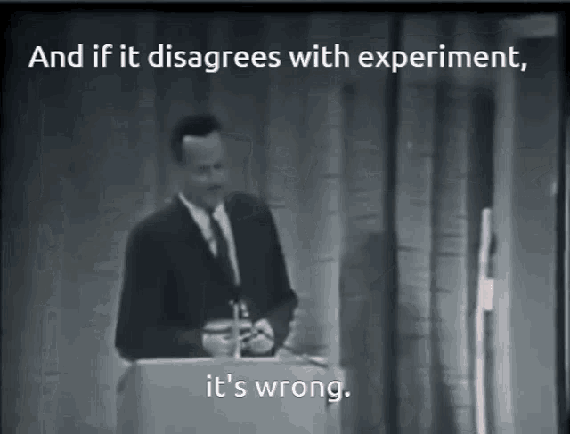
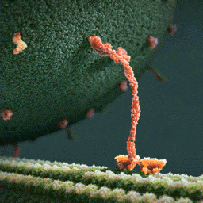

    
    
    

# 💁🏻‍♀️ Hello, I am Melika ....

- 🔭 Presently, I am engaged in a one-year research endeavor at the University of Padova, focusing on the integration of Artificial Intelligence techniques with disordered protein structures. Additionally, I am conducting a scaling ansatz analysis on droplet size distributions in protein condensates as part of this research pursuit.

- ⚡ Alongside my background in **theoretical physics**, and **mathematics**, I have received comprehensive training in various aspects of computation, including **machine learning**, **deep learning**, **data analysis**, **data management**, and **distributed computing**.

## My skills 💻:

## My most important projects🗃️:

1. **My research projects**: *The GitHub repositories associated with these projects are presently set to private access. This confidentiality has been implemented at the team's request, primarily in anticipation of forthcoming publications*.
 
2. [**My master's thesis**](https://github.com/Melikakmm/Master_Thesis/tree/main)
3.  [**Gaussian Regression interatomic potentials**](https://github.com/Melikakmm/GPR_fitting_interactive_potential)
4. [**Audio classification**](https://github.com/Melikakmm/CNN-for-sound-classification)
5. [**Graph Neural Network for Frustration index**(still ongoing and not finnished)](https://github.com/Melikakmm/GNN_Frustration)
6. [**Cython/Python wrapper for SEVN**](https://github.com/Melikakmm/SEVN_PYTHON_WRAPPER)
7. [**The FPGA Project With VHDL**](https://github.com/Melikakmm/FPGA)
8. [**Low-Mass-X-ray-Binaries**](https://github.com/Melikakmm/Low-Mass-X-ray-Binaries)
9. [**Volatility-carry-trading-strategy**](https://github.com/Melikakmm/Volatility-carry-trading-strategy)
    
10.[**Advanced Statistics With R**](https://github.com/Melikakmm/R_Projects)

