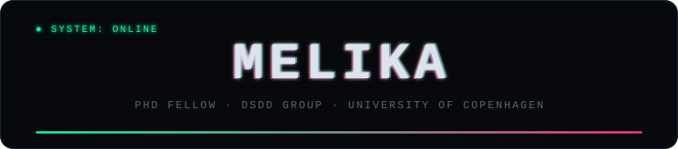
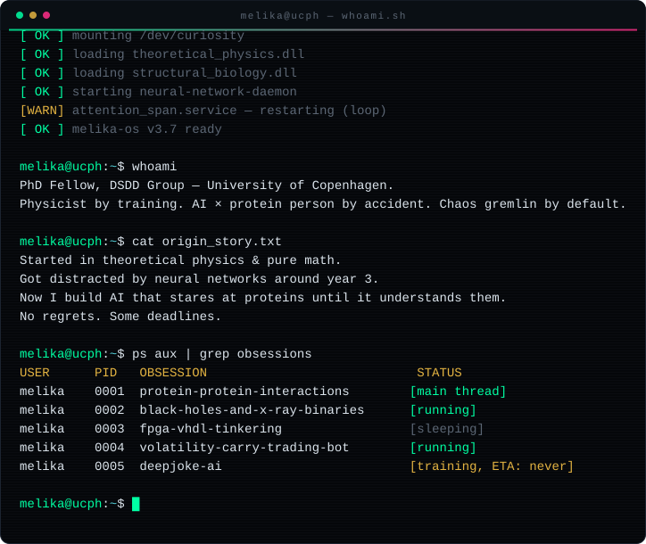
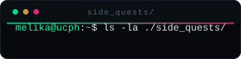
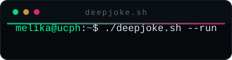
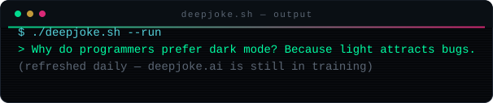
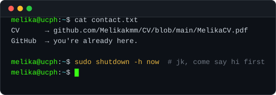

  

  

  
  

  

  
  
  
  
   
  
  
  
  
  
  
   
  
  
   
  
  
  
  
  
  

  

| process | what it actually is | status | link |
|---|---|---|---|
| 🧬 `protein-protein-interactions` | PhD project — AI meets structural biology | `● main thread` | private, ask nicely |
| 🕳️ `low-mass-xray-binaries` | the black-hole physics phase I never grew out of | `● running` | [repo](https://github.com/Melikakmm/Low-Mass-X-ray-Binaries) |
| 📈 `volatility-carry-bot` | AI vs. the stock market — AI is losing gracefully | `● running` | [repo](https://github.com/Melikakmm/Volatility-carry-trading-strategy) |
| 🗣️ `nlp-translation` | transformers learning to translate, ongoing | `● running` | [repo](https://github.com/Melikakmm/NLP_Translation) |
| 🕸️ `gnn-frustration-index` | graph nets for frustrated systems, relatable | `● running` | [repo](https://github.com/Melikakmm/GNN_Frustration) |
| 😂 `deepjoke` | an AI that attempts humor, results mixed (see below ↓) | `◐ training` | _coming soon_ |
| 🔌 `fpga-vhdl` | taught hardware to blink in a specific pattern | `○ sleeping` | [repo](https://github.com/Melikakmm/FPGA) |
| 🎧 `cnn-sound-classification` | teaching a CNN to listen | `○ sleeping` | [repo](https://github.com/Melikakmm/CNN-for-sound-classification) |
| ⚛️ `sevn-python-wrapper` | cython/python wrapper for stellar evolution code | `○ sleeping` | [repo](https://github.com/Melikakmm/SEVN_PYTHON_WRAPPER) |
| 🔮 `gpr-interatomic-potentials` | gaussian regression for atoms behaving nicely | `○ sleeping` | [repo](https://github.com/Melikakmm/GPR_fitting_interactive_potential) |
| 📊 `r-projects` | advanced statistics, R edition | `○ sleeping` | [repo](https://github.com/Melikakmm/R_Projects) |
| 🎓 `masters-thesis` | where this all started getting serious | `✓ exited(0)` | [repo](https://github.com/Melikakmm/Master_Thesis/tree/main) |

 

  
   
  

 

  

  <picture>
    <source media="(prefers-color-scheme: dark)" srcset="https://raw.githubusercontent.com/Melikakmm/Melikakmm/output/github-contribution-grid-snake-dark.svg" />
    <source media="(prefers-color-scheme: light)" srcset="https://raw.githubusercontent.com/Melikakmm/Melikakmm/output/github-contribution-grid-snake.svg" />
    
  </picture>

  

