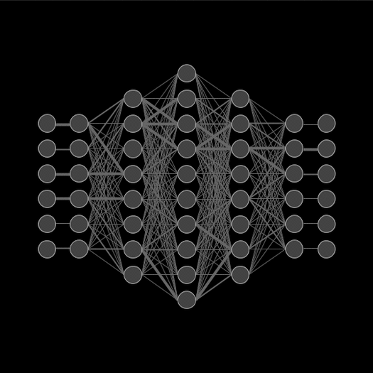

    
    
    
    

---

# 👋 Hi, I’m **Melika**  

> _Exploring the complexity of **protein–protein interactions** through the lens of AI and computational science._  

🎓 I’m currently a **PhD Fellow** at the **University of Copenhagen** in the **DSDD Group**,  
where I blend **artificial intelligence** with **structural biology** to decode the language of proteins.

With a solid foundation in **theoretical physics** and **mathematics**,  
I’ve evolved into a researcher skilled in:

- 💡 Machine Learning & Deep Learning  
- 📊 Data Science & Statistical Analysis  
- 🧬 Protein Structure Prediction  
- 🐍 Python, R, C++, Cython 
- ☁️ Distributed Computing & Cloud Toolkits  

---

## 📄 [Download My CV](https://github.com/Melikakmm/CV/blob/main/MelikaCV.pdf)

---

## 💻 Tech Stack & Tools

    
    
    
    
    
    
    
    
    
    
    
    
    
    
    
    
    
    

---

## 🧪 Featured Projects

| 📂 Project | 🔗 Link |
|------------|---------|
| Scaling Ansatz for Protein Condensate Droplet Size Distributions | *Private — pending publication* |
| DeepDisorder | *Private — pending publication* |
| My Master's Thesis | [View Repository](https://github.com/Melikakmm/Master_Thesis/tree/main) |
| Translation For Different Languages Using Transformers *(Ongoing)* | [Explore Project](https://github.com/Melikakmm/NLP_Translation) |
| DeepJoke *(Upcoming)* | _Coming soon_ |
| Gaussian Regression for Interatomic Potentials | [Explore Project](https://github.com/Melikakmm/GPR_fitting_interactive_potential) |
| Audio Classification using CNN | [Explore Project](https://github.com/Melikakmm/CNN-for-sound-classification) |
| Graph Neural Network for Frustration Index *(Ongoing)* | [Explore Project](https://github.com/Melikakmm/GNN_Frustration) |
| Cython/Python Wrapper for SEVN | [Explore Project](https://github.com/Melikakmm/SEVN_PYTHON_WRAPPER) |
| The FPGA Project with VHDL | [Explore Project](https://github.com/Melikakmm/FPGA) |
| Low-Mass X-ray Binaries | [Explore Project](https://github.com/Melikakmm/Low-Mass-X-ray-Binaries) |
| AI for Volatility-Carry Trading Strategy | [Explore Project](https://github.com/Melikakmm/Volatility-carry-trading-strategy) |
| Advanced Statistics With R | [Explore Project](https://github.com/Melikakmm/R_Projects) |

---

✨ _Thanks for stopping by!_  
_Always curious, always learning._  
💌 Feel free to connect & collaborate!

---

